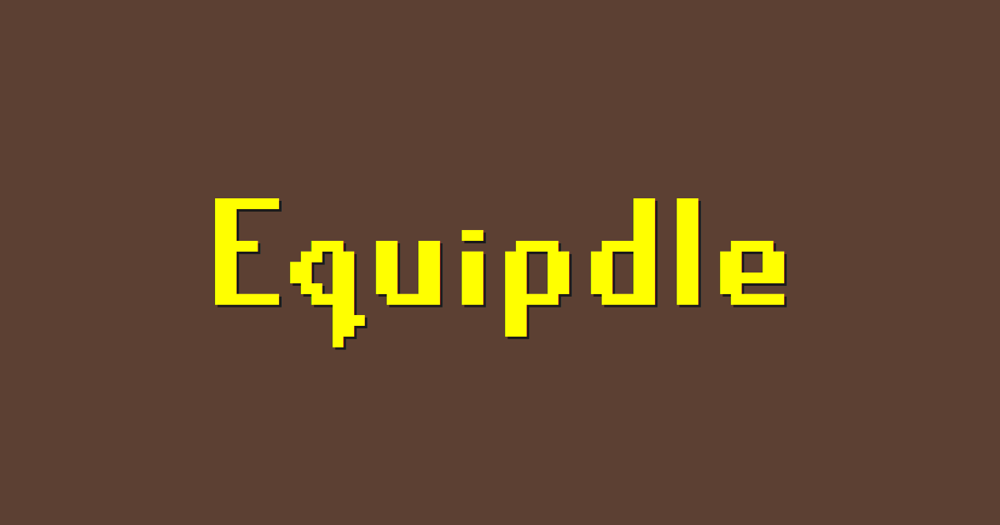

# Equipdle

**Equipdle** is a web-based guessing game centered around the items from Old School RuneScape. The primary objective for the player is to identify a secret equipable item of the day selected by the system. With each guess, the game provides comparative feedback across several of the item's attributes, guiding the player toward the correct answer.

## How to Play

You can play the game at the [Equipdle website](https://equipdle.com).

## Features

* **Daily & Random Modes:** Play the official daily challenge or practice with unlimited random items.
* **Detailed Attribute Comparison:** Get feedback on 7+ item attributes with every guess.
* **Autocomplete Search:** Easily find any of the thousands of equipable items.
* **Persistent State:** Your daily game progress is saved locally, so you can pick up where you left off.
* **Game Statistics:** Track game metrics like wins, losses, and guess distribution.

## Technical Documentation

For a detailed explanation of the project's architecture and implementation, please see the [technical documentation](technical-doc.md).
