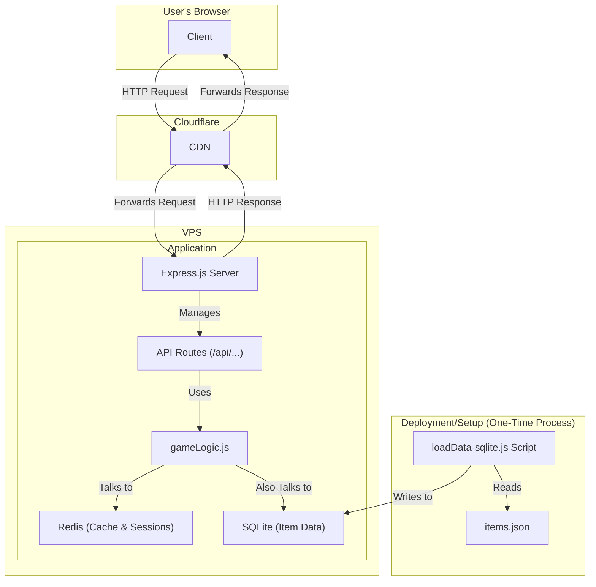
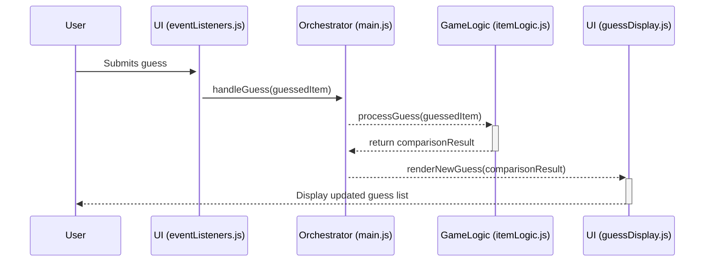

# Equipdle

**Live Game:** [equipdle.com](https://equipdle.com)

## 1. Project Overview

Equipdle is a daily browser-based guessing game where the primary objective for the player is to identify a secret, equipable item from the world of Old School Runescape. With each guess, the game provides comparative feedback across several of the item's attributes, guiding the player toward the correct answer.

This project was conceived as an end-to-end development exercise, encompassing the full lifecycle from initial concept and architecture to deployment and live operations of a public-facing web application.

## 2. The Tech Stack

This section details the technologies used to build Equipdle and, more importantly, the reasoning behind their selection.

### Frontend: HTML, CSS, & Vanilla JavaScript

The project was intentionally architected with a minimalist frontend stack, completely free of external frameworks. This self-contained, framework-less approach was chosen to demonstrate mastery of core web technologies and to ensure the application remains lightweight, fast-loading, and universally compatible.

### Backend: Node.js, Express.js & Middleware

The backend server is built using the Node.js runtime and the Express.js framework. This was chosen for its performance with I/O-heavy operations and its vast ecosystem.

-   **Middleware**: The application is secured with standard middleware, including `Helmet` to set secure HTTP headers and `express-rate-limit` for DDoS protection.

### Databases: SQLite & Redis

-   **SQLite**: Used as the primary, persistent database for all core item data. Its file-based, serverless nature simplifies deployment and setup, making it ideal for storing the application's foundational, read-heavy dataset.
-   **Redis**: Employed as a high-speed, in-memory cache for hot data, for managing ephemeral game states (like active sessions), and for collecting real-time statistics. This hybrid approach leverages the strengths of both database types.

### Build & Optimisation Tools

To ensure the fastest possible load times for the end user, the project employs a suite of build tools to minify and bundle the frontend assets.

-   **HTML**: The `html-minifier` package is used to reduce the size of the main `index.html` file. It achieves this by collapsing whitespace and removing comments from the production build, resulting in a smaller file that the browser can download and parse more quickly.
-   **CSS**: All CSS files are concatenated and then minified using `csso-cli`, which significantly reduces the size of the stylesheet.
-   **JavaScript**: The modern and extremely fast `esbuild` bundler is used to bundle all JavaScript modules into a single file and minify the output.

This automated optimisation process is a key part of the deployment pipeline, ensuring that the application served to users is as lightweight and performant as possible.

### Hosting & Deployment

-   **VPS Hosting**: The backend is hosted on a cloud-based Virtual Private Server (VPS), which offers full control over the hosting environment.
-   **Cloudflare**: Cloudflare sits in front of the application, providing DNS management, SSL encryption, performance caching (CDN), and analytics.

## 3. Architecture & Design Decisions

This section covers the key architectural decisions for both the backend and frontend.

### Backend Architecture

The backend is a monolithic Node.js application that serves a RESTful API. It uses a hybrid database model: SQLite for persistent storage and Redis for caching and session management. This architecture is designed to be both simple and performant.



### Frontend Architecture

The frontend is designed as a Single-Page Application (SPA) where the entire user experience is delivered from a single HTML file.

-   **Core Principle: Dynamic DOM Manipulation**
    
    `index.html` serves as the static application shell. Once loaded, JavaScript takes full control of the page. All UI elements, content rendering, and state transitions are performed dynamically through direct DOM manipulation, creating a fluid user experience without requiring page reloads.

-   **Client-Side Data Flow**
    
    The application's control flow is unidirectional and orchestrated by a central `main.js` module, which coordinates between user input, game logic, and UI rendering.



## 4. API Documentation

The backend exposes a RESTful API for all game-related interactions.

### Game Endpoints

#### `POST /game/start`

Starts a new game session.

-   **Body**:
    ```json
    { "type": "daily" }
    ```
-   **Returns**:
    ```json
    { "gameId": "a-uuid-string" }
    ```

#### `POST /game/:id/guess`

Submits a guess for an active game.

-   **Body**:
    ```json
    { "guessItemId": 123 }
    ```
-   **Returns**: A feedback object, remaining health, and full item data on game end.

#### `GET /game/:id`

Retrieves the state of an active game, for scenarios like a page reload.

-   **Returns**:
    ```json
    {
      "guesses": [],
      "health": 7,
      "currentItemId": 456
    }
    ```

#### `GET /game/:id/examine`

Retrieves the "examine" text for the correct item.

-   **Returns**:
    ```json
    {
      "examine": "A powerful sword.",
      "title": "Dragon Longsword"
    }
    ```

### Item & Stat Endpoints

#### `GET /items`

Retrieves a simplified list of all items for the search dropdown.

#### `POST /item/vote`

Records a user's vote on whether an item was a good choice for the daily puzzle.

-   **Body**:
    ```json
    {
      "gameId": "a-uuid-string",
      "vote": "yes"
    }
    ```

## 5. Key Technical Challenges & Solutions

### Challenge: Designing a Hybrid Database Strategy

-   **Problem**: The application has different data needs: a large, stable dataset of items that is read frequently, and volatile, short-lived data for active game sessions and real-time stats.
-   **Solution**: I implemented a hybrid database strategy to leverage the best tool for each job. The core item data is loaded into a file-based SQLite database, providing simple, reliable, and persistent storage. For performance, Redis is used as an in-memory caching layer on top of SQLite for frequently accessed items. Redis is also used for its primary purpose in the app: managing all ephemeral data like active game sessions and collecting high-durability statistics. This separation ensures both data integrity and high performance.

### Challenge: Preventing Spam and Malicious API Use

-   **Problem**: Any public API is a target for malicious actors.
-   **Solution**: I implemented rate-limiting using `express-rate-limit`, configured to allow approximately 100 requests per 15 minutes per IP. This limit is generous enough not to interfere with normal gameplay but strict enough to prevent basic brute-force attacks.

## 6. Future Improvements

-   **"Hard Mode"**: Introduce a "hard mode" toggle that hides certain clues to provide a greater challenge for experienced players.
-   **Accessibility Enhancements**: While there are accessibility options, further work could be done to improve screen reader support and color contrast.
-   **Admin Dashboard**: Build a simple internal dashboard to view site analytics and manually override the daily item if needed.